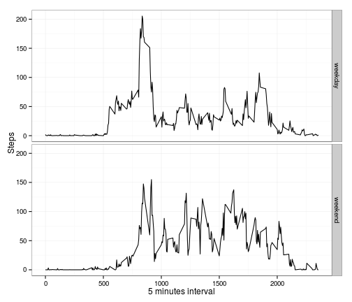

# "Reproducible Research: Peer Assessment 1"

#### author: Micael Eiji Nagai

## Loading and preprocessing the data
Loading/installing some packages and acquiring and processing the data:


```r
file <- 'http://d396qusza40orc.cloudfront.net/repdata%2Fdata%2Factivity.zip'
if(!file.exists('.//activity.zip')) download.file( url = file, destfile = ".//activity.zip")
if(!file.exists( './/data//activity.csv')) unzip('.//activity.zip', exdir = './/data')
if(!require('data.table'))install.packages('data.table');library('data.table')
if(!require('ggplot2'))install.packages('ggplot2');library('ggplot2')
dtable <- read.table( './/data//activity.csv', sep = ',', header = TRUE)
dtable$date <- as.Date( dtable$date, format = "%Y-%m-%d")
dtable <- data.table(dtable)
```


## What is mean total number of steps taken per day?

The total number of steps taken per day:

```r
dtable[, list(sum.steps=sum(steps, na.rm = TRUE)), by = date]
```

```
##           date sum.steps
##  1: 2012-10-01         0
##  2: 2012-10-02       126
##  3: 2012-10-03     11352
##  4: 2012-10-04     12116
##  5: 2012-10-05     13294
##  6: 2012-10-06     15420
##  7: 2012-10-07     11015
##  8: 2012-10-08         0
##  9: 2012-10-09     12811
## 10: 2012-10-10      9900
## 11: 2012-10-11     10304
## 12: 2012-10-12     17382
## 13: 2012-10-13     12426
## 14: 2012-10-14     15098
## 15: 2012-10-15     10139
## 16: 2012-10-16     15084
## 17: 2012-10-17     13452
## 18: 2012-10-18     10056
## 19: 2012-10-19     11829
## 20: 2012-10-20     10395
## 21: 2012-10-21      8821
## 22: 2012-10-22     13460
## 23: 2012-10-23      8918
## 24: 2012-10-24      8355
## 25: 2012-10-25      2492
## 26: 2012-10-26      6778
## 27: 2012-10-27     10119
## 28: 2012-10-28     11458
## 29: 2012-10-29      5018
## 30: 2012-10-30      9819
## 31: 2012-10-31     15414
## 32: 2012-11-01         0
## 33: 2012-11-02     10600
## 34: 2012-11-03     10571
## 35: 2012-11-04         0
## 36: 2012-11-05     10439
## 37: 2012-11-06      8334
## 38: 2012-11-07     12883
## 39: 2012-11-08      3219
## 40: 2012-11-09         0
## 41: 2012-11-10         0
## 42: 2012-11-11     12608
## 43: 2012-11-12     10765
## 44: 2012-11-13      7336
## 45: 2012-11-14         0
## 46: 2012-11-15        41
## 47: 2012-11-16      5441
## 48: 2012-11-17     14339
## 49: 2012-11-18     15110
## 50: 2012-11-19      8841
## 51: 2012-11-20      4472
## 52: 2012-11-21     12787
## 53: 2012-11-22     20427
## 54: 2012-11-23     21194
## 55: 2012-11-24     14478
## 56: 2012-11-25     11834
## 57: 2012-11-26     11162
## 58: 2012-11-27     13646
## 59: 2012-11-28     10183
## 60: 2012-11-29      7047
## 61: 2012-11-30         0
##           date sum.steps
```

A histogram showing these information:

```r
gg <- ggplot(dtable[, list(sum.steps=sum(steps, na.rm = TRUE)), by = date])
gg <- gg+geom_histogram(aes(x = sum.steps),binwidth = 400)+theme_classic()
gg <- gg+labs(x='Steps')
print(gg)
```

 

Some summary, including mean and median of the steps:

```r
dtable[, list(sum.steps=sum(steps, na.rm = TRUE)), by = date][,summary(sum.steps)]
```

```
##    Min. 1st Qu.  Median    Mean 3rd Qu.    Max. 
##       0    6778   10400    9354   12810   21190
```

## What is the average daily activity pattern?

Daily activity pattern, through 5 min interval, measured as a average from the days. 


```r
gg <- ggplot( data = dtable[, list( av = mean(steps,na.rm = TRUE)), by = interval], aes(x=interval, y=av))
gg <- gg + geom_line( ) + labs(y='Mean steps',x='Daily interval (5 min)')
gg <- gg + theme_classic()
print(gg)
```

 

On average the interval that the individual made more steps was:


```r
dtable[, list( av = mean(steps,na.rm = TRUE)), by = interval][which(av==max(av))]
```

```
##    interval       av
## 1:      835 206.1698
```

## Imputing missing values

The amount of NA's on steps variable of the data:


```r
dtable[is.na(steps), length(steps)]
```

```
## [1] 2304
```

To fill the NA's value I will use the median for the 5 minutes interval.
The new dataset will be named nafilled.


```r
nafilled <- copy(dtable)
setkey(nafilled,interval)

steps.na <- which(is.na(nafilled[,steps]))
interval.na <- nafilled[steps.na,interval]
data.tmp <- dtable[,list(av=median(steps,na.rm=TRUE)),by=interval]
nafilled[steps.na, `:=`  (steps = data.tmp[interval==interval.na,av])]
```

```
##        steps       date interval
##     1:     0 2012-10-01        0
##     2:     0 2012-10-02        0
##     3:     0 2012-10-03        0
##     4:    47 2012-10-04        0
##     5:     0 2012-10-05        0
##    ---                          
## 17564:     0 2012-11-26     2355
## 17565:     0 2012-11-27     2355
## 17566:     0 2012-11-28     2355
## 17567:     0 2012-11-29     2355
## 17568:     0 2012-11-30     2355
```

```r
rm(data.tmp)
```

And the histogram for the filled NA data


```r
gg <- ggplot( data = nafilled, aes( x = steps))
gg <- gg+geom_histogram(binwidth = 30)
gg <- gg+theme_classic()
print(gg)
```

 

Changing the NA's values for the median of steps of the 5 minutes interval that it belong inserted a lot of 0's values, so the counts of it increased a lot.

## Are there differences in activity patterns between weekdays and weekends?

Creating a factor variable with the value of weekday and weekend.
And then creating a temporary data.table with the average steps by the 5 minutes interval for the weekday and weekend.


```r
weekend <- c('saturday','sunday')
nafilled[, week:= as.factor(ifelse(tolower(weekdays(date)) %in% weekend, 'weekend','weekday'))]
```

```
##        steps       date interval    week
##     1:     0 2012-10-01        0 weekday
##     2:     0 2012-10-02        0 weekday
##     3:     0 2012-10-03        0 weekday
##     4:    47 2012-10-04        0 weekday
##     5:     0 2012-10-05        0 weekday
##    ---                                  
## 17564:     0 2012-11-26     2355 weekday
## 17565:     0 2012-11-27     2355 weekday
## 17566:     0 2012-11-28     2355 weekday
## 17567:     0 2012-11-29     2355 weekday
## 17568:     0 2012-11-30     2355 weekday
```

```r
data.tmp <- nafilled[, list(av= mean(steps)),by = list(interval,week)]
```
Plot the average steps on the 5 minutes interval for the weekday and weekend.


```r
gg <- ggplot(data=data.tmp,aes( x = interval, y = av))
gg <- gg+geom_line() + facet_grid(week~.)
gg <- gg+theme_bw() + labs( x='5 minutes interval', y='Steps')
print(gg)
```

 
